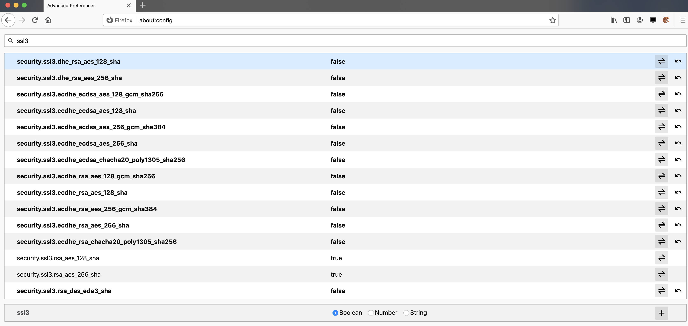

<h2>Capture the pcap</h2>

In order to make a connection to the server that can be attacked using Bleichenbacher’s attack, some configuration changes need to be made. This is necessary because most modern applications have blocked the use of the RSA key agreement protocols because of their vulnerabilities. Our server therefore supports RSA and ECDH algorithms, and we need to force the clients to use RSA in order to demonstrate the attack. We show how to achieve this with 2 web clients, curl and Firefox.

*	When using curl, the --ciphers AES128-SHA:AES256-SHA256 option should be added when connecting to the server to select the right cipher suite, in addition to the flag--insecure to ignore errors about the self-signed certificate.
*	When connecting from the browser Firefox, all key agreement protocols except for the RSA ones need to be disabled. Enter about:config in the url bar. In the configuration, options, search for the term ssl3. Flip all resulting options to false except for security.ssl3.rsaaes256sha and security.ssl3.rsaaes128sha. After this,a connection to the server can be opened with only RSA being the negotiated ciphersuite. Refer to the screenshot shown below.

Note that we can only capture the traffic belonging to one client-server pair, i.e, traffic involving only one client. This is due to a limitation in the attack script that we discuss about in Section-4.3.3 of the report.

<h2>Run the Demo</h2>

1.	Clone the Erlang server repository and the attack script repository as given below.

	`> git clone https://github.com/jonathanraes/erlang-tlsserver`\
	`> git clone https://github.com/sudharshankr/robot-detect`

2. Build the Erlang server and start the container with the help of the Dockerfile present in the directory erlang-tlsserver.
	
	`> docker build -t erlang-server .`\
	`> docker run --publish 4000:4000 --name erlang-server erlang-server`
	
	The above server will run on port 4000 and the port 4000 on the host is forwarded tothis server.

3. Change into the directory robot-detect/docker. Install the requirements using the following command.
	
	`> pip install -r requirements.txt`

4. Change into the directoryrobot-detect. Run the attack by executing the attack.pyfile along with the captured pcapfile as the command-line argument as shown below, or leaving out the argument to listen on the localhost interface.

	`> python attack.py capture.pcapng`
	or
	`> python attack.py`
	
	For the interactive mode, run the python file and make a request using curl or acorrectly configured browser as described in the previous section.
	
<h2>Limitation of the attack script</h2>
Currently the attack script is capable of handling communication between 2 parties, i.e., one client and server. If the captured <em>pcap</em> file or the intercepted communication on localhost has more than one client communicating with the server, the attack script will be able to decrypt the traffic belonging to only one pair of client and server, the one that it encounters first, and will not be able to decrypt any other traffic corresponding to the communication involving other clients. We were not able to code out a solution to this problem due to the time constraints. We overcome this problem by filtering out the packets belonging to each client with the help of a tool such as Wireshark. This can help us to create separate <em>pcap</em> files corresponding to each client which can then be fed to our attack script to perform the decryption.

Additionally, the attack script currently only supports the RSA_AES cipher suites `RSA_AES_128_SHA` and `RSA_AES_256_SHA`, the DES cipher `RSA_DES_EDE3_SHA` is currently not supported.
